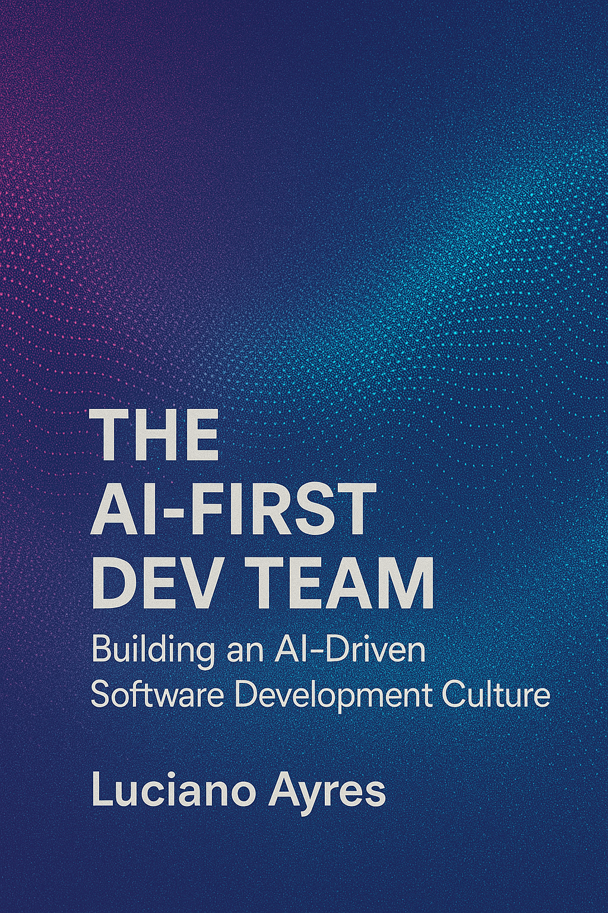

# The AI-First Dev Team: Building an AI-Driven Software Development Culture

**[The AI-First Dev Team: Building an AI-Driven Software Development Culture](./The_AI-First_Dev_Team_Building_AI-Driven_Software_Development_Culture.md)**  
_A Practical Guide to Cultivating AI-Driven Software Development Cultures_

By **[Luciano Ayres](https://www.linkedin.com/in/lucianoayres/)**

**First Edition | Published April 27, 2025**  
**Version 1.0**

---

## About the Book 📖

_The AI-First Dev Team: Building an AI-Driven Software Development Culture_ is a hands-on playbook for leaders and decision-makers—CEOs, CTOs, VPs of Engineering, and team leads—who want to transform their engineering organizations. Drawing on real‐world examples from both tech giants and innovative startups, this book lays out the frameworks, practices, and metrics you need to:

- Understand the disruptive power of AI-enabled coding tools in shaping team culture
- Build an environment of experimentation, decentralized learning, and continuous improvement
- Integrate both “smart” IDE assistants and multi-step agentic coding tools into your workflows
- Measure impact, mitigate risks, and scale AI successes across the organization

Whether you’re embarking on a small pilot or planning an enterprise-wide rollout, this guide will equip you with actionable insights and ready-to-use templates to lead your teams into an AI-first future.

---

## How to Read the Book 📚

Read the complete book for free by clicking below:

[Read the Book (Markdown)](./The_AI-First_Dev_Team_Building_AI-Driven_Software_Development_Culture.md)

Prefer a PDF version? Download it here:

[Download PDF](./pdf/The_AI-First_Dev_Team_Building_an_AI-Driven_Software_Development_Culture_by_Luciano_Ayres.pdf)

Or choose the Epub version:

[Download Epub](./epub/The_AI-First_Dev_Team_Building_an_AI-Driven_Software_Development_Culture_by_Luciano_Ayres.epub)

---

## Table of Contents 📝

[Introduction](./The_AI-First_Dev_Team_Building_AI-Driven_Software_Development_Culture.md#introduction)

- The evolution of software teams and methodologies
- The paradigm shift brought by AI-enabled tools
- Central thesis: AI transforms cultures, not just code
- Defining this book’s roadmap and audience

[Chapter 1: Shaping Tomorrow's Dev Culture with AI](./The_AI-First_Dev_Team_Building_AI-Driven_Software_Development_Culture.md#chapter-1-shaping-tomorrows-dev-culture-with-ai)

- Why leaders must proactively embrace AI today
- Insights from Satya Nadella and Peter Drucker on innovation
- Early productivity gains with AI assistants
- Actionable steps to pilot AI in your organization

[Chapter 2: Understanding AI-Enabled Developer Tools](./The_AI-First_Dev_Team_Building_AI-Driven_Software_Development_Culture.md#chapter-2-understanding-ai-enabled-developer-tools)

- Smart IDE assistants vs. agentic platforms
- Overview of mainstream tools (Copilot, CodeWhisperer, Tabnine)
- Emerging agentic editors (Cursor AI, Windsurf, etc.)
- Strategies for low-risk experimentation

[Chapter 3: Building an AI-Innovation Culture](./The_AI-First_Dev_Team_Building_AI-Driven_Software_Development_Culture.md#chapter-3-building-an-ai-innovation-culture)

- Fostering a growth mindset and clear AI vision
- The role of AI Champions and peer networks
- Best practices for communication and incentives
- Addressing skepticism and resistance

[Chapter 4: Integrating Agentic Tools](./The_AI-First_Dev_Team_Building_AI-Driven_Software_Development_Culture.md#chapter-4-integrating-agentic-tools)

- Phased approach: use cases, sandbox pilots, oversight
- Crafting effective prompts and refining workflows
- Case study: legacy code modernization with AI
- Scaling agentic practices across teams

[Chapter 5: Empowering People With Skills and Training](./The_AI-First_Dev_Team_Building_AI-Driven_Software_Development_Culture.md#chapter-5-empowering-people-with-skills-and-training)

- Hands-on workshops and hackathons for AI tools
- Hiring for adaptability and AI-focused roles
- Building internal playbooks and mentorship programs
- Cross-functional collaboration for shared learning

[Chapter 6: Empowering Teams Through Decentralized Learning](./The_AI-First_Dev_Team_Building_AI-Driven_Software_Development_Culture.md#chapter-6-empowering-teams-through-decentralized-learning)

- Creating a central AI/ML learning portal
- Curating and refreshing top courses and tutorials
- Encouraging self-driven study and knowledge sharing
- Maintaining an up-to-date learning library

[Chapter 7: Fueling Innovation with Open-Source AI Tools](./The_AI-First_Dev_Team_Building_AI-Driven_Software_Development_Culture.md#chapter-7-fueling-innovation-with-open-source-ai-tools)

- Benefits of open-source: cost, flexibility, community
- Key projects: Ollama, Hugging Face Transformers, CrewAI
- Building an internal open-source AI toolbox
- Contributing back and sustaining the toolkit

[Chapter 8: Reimagining Workflows](./The_AI-First_Dev_Team_Building_AI-Driven_Software_Development_Culture.md#chapter-8-reimagining-workflows)

- AI in Agile planning, CI/CD, QA, and retrospectives
- Auto-generated user stories, test cases, and docs
- AI-assisted code reviews and pipeline integrations
- Iterating processes based on real-world feedback

[Chapter 9: Measuring Impact](./The_AI-First_Dev_Team_Building_AI-Driven_Software_Development_Culture.md#chapter-9-measuring-impact)

    - Defining productivity, quality, adoption, and business KPIs
    - Balancing quantitative metrics with developer feedback
    - Dashboards, reports, and leadership reviews
    - Evolving measures as your AI practice matures

[Chapter 10: Real-World Case Studies](./The_AI-First_Dev_Team_Building_AI-Driven_Software_Development_Culture.md#chapter-10-real-world-case-studies)

    - Profiles of Microsoft, Google, Amazon, Meta, and startups
    - Pilot strategies, scalability tactics, and outcomes
    - Lessons on matching AI tools to your context
    - Inspiring teams through shared success stories

[Chapter 11: Risks and Best Practices](./The_AI-First_Dev_Team_Building_AI-Driven_Software_Development_Culture.md#chapter-11-risks-and-best-practices)

    - Mitigating hallucinations and enforcing code reviews
    - Security, IP, and licensing considerations
    - Preventing overreliance and preserving core skills
    - Crafting clear AI usage policies and ethical guidelines

[Chapter 12: Continuous Innovation and the Future](./The_AI-First_Dev_Team_Building_AI-Driven_Software_Development_Culture.md#chapter-12-continuous-innovation-and-the-future)

    - Ongoing learning and process iteration
    - Scaling and productizing internal AI successes
    - Leadership advocacy and vision maintenance
    - Preparing for next-generation AI advancements

[References](./The_AI-First_Dev_Team_Building_AI-Driven_Software_Development_Culture.md#references)

---

## Contributing & Feedback 🤝

Your feedback is highly appreciated! If you have suggestions, corrections, or improvements, please open an issue or submit a pull request in this repository. Contributions that enhance clarity, examples, or practical tools are especially welcome.

---

## License 📄

This work is licensed under the [Creative Commons Attribution-ShareAlike 4.0 International License](https://creativecommons.org/licenses/by-sa/4.0/).
